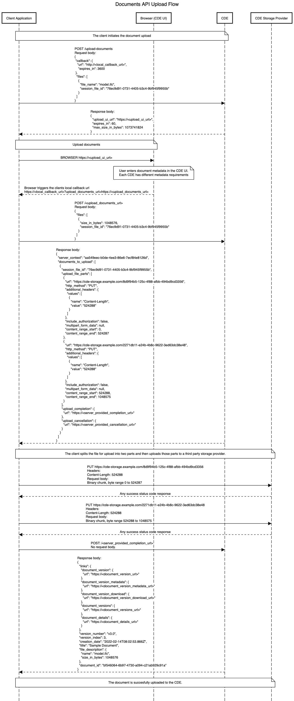

[](https://www.buildingsmart.org/)
[](https://img.shields.io/badge/-BCF%20Implementers%20Group-blue.svg)

[Swagger / OpenAPI Specification](./swagger.yaml). To view an interactive version of the Swagger specification, you can go to <https://editor.swagger.io/> and pase the content from the YAML file.

# Documents API


The Documents API is designed to streamline the process of downloading and uploading files to a common data environment (CDE). This specification details the _selection_ or _discovery_, _download_ and _upload_ of files. When supported by both client and server, it provides an easy to use and integrated way of syncing cloud stored documents from within local applications. For the purpose of this specification a Documents consists of a file and its metadata.The scope of the Documents API includes all file types; The scope is not limited to building information models.

## Contributing

The Open CDE workgroup develops the BCF standard. The group meets every second Monday at 11am CET. To join the fortnightly meeting please email [opencde@buildingsmart.org](mailto:opencde@buildingsmart.org).

<!-- toc  https://ecotrust-canada.github.io/markdown-toc/ -->

- [Documents API](#documents-api)
  - [Contributing](#contributing)
- [1. Introduction](#1-introduction)
  - [1.1. OpenCDE Foundation API](#11-opencde-foundation-api)
- [2. Overview](#2-overview)
  - [2.1. How does the Document API work?](#21-how-does-the-document-api-work)
  - [2.2. Use Cases](#22-use-cases)
    - [2.2.1. Download Files](#221-download-files)
      - [2.2.1.1. Automatic download of a file previously uploaded or downloaded](#2211-automatic-download-of-a-file-previously-uploaded-or-downloaded)
    - [2.2.2. Upload Files](#222-upload-files)
    - [2.2.3. Using the Documents API and BCF API Together](#223-using-the-documents-api-and-bcf-api-together)
      - [2.2.3.1. BCF File References](#2231-bcf-file-references)
    - [2.2.4. Automatic syncing of documents between two or more CDEs](#224-automatic-syncing-of-documents-between-two-or-more-cdes)
- [3. Services](#3-services)
  - [3.1. Open API (Swagger) Specification - The Single Source of Truth](#31-open-api-swagger-specification---the-single-source-of-truth)
    - [3.1.1. Open Source Example](#311-open-source-example)
  - [3.2. Document Download](#32-document-download)
    - [3.2.1. Document Download Example](#321-document-download-example)
      - [3.2.1.1. Step-by-Step Example](#3211-step-by-step-example)
        - [3.2.1.1.1. Initiating Download](#32111-initiating-download)
        - [3.2.1.1.2. CDE Selection Response](#32112-cde-selection-response)
        - [3.2.1.1.3. User Selects Documents in CDE UI](#32113-user-selects-documents-in-cde-ui)
        - [3.2.1.1.4. Client Queries Document Versions](#32114-client-queries-document-versions)
  - [3.3. Document Upload](#33-document-upload)
    - [3.3.1. Binary File Upload](#331-binary-file-upload)
      - [3.3.1.1. Multipart Upload Considerations & Implementation Notes](#3311-multipart-upload-considerations--implementation-notes)
      - [3.3.1.2. Identifying Files During the Workflow](#3312-identifying-files-during-the-workflow)
      - [3.3.1.3. Why This Workflow](#3313-why-this-workflow)
    - [3.3.2. Document Upload Example](#332-document-upload-example)
      - [3.3.2.1. Sequence Diagram](#3321-sequence-diagram)
      - [3.3.2.2. Step-by-Step Example](#3322-step-by-step-example)
        - [3.3.2.2.1. Initiating Upload](#33221-initiating-upload)
        - [3.3.2.2.2. CDE Upload Response](#33222-cde-upload-response)
        - [3.3.2.2.3. User Enters File Data in CDE UI](#33223-user-enters-file-data-in-cde-ui)
        - [3.3.2.2.4. Client Queries Upload Instructions](#33224-client-queries-upload-instructions)
        - [3.3.2.2.5. Binary File Upload](#33225-binary-file-upload)
        - [3.3.2.2.6. Upload Completion](#33226-upload-completion)
        - [3.3.2.2.7. Upload Cancellation](#33227-upload-cancellation)

<!-- tocstop -->

# 1. Introduction

## 1.1. OpenCDE Foundation API

Documents API is a member of the OpenCDE API family. All OpenCDE APIs are united by a shared common API called [OpenCDE Foundation API](https://github.com/buildingSMART/foundation-API).  
The foundation API specifies a small number of services and a few conventions that are common to all OpenCDE APIs. All Documents API implementations must implement the Foundation API and follow its conventions and guidelines. Implementers should start by implementing the Foundation API and only then continue to implement the Documents API.

> Note: Other APIs built on top of the OpenCDE Foundation API include the [BCF API for the BIM Collaboration Format](https://github.com/buildingSMART/BCF-API).

# 2. Overview

The Documents API identifies the following actors:

- User - A human, performing a task requiring the download or the upload of files
- Client Application - A desktop Application or a Web Application used by the User to perform her task
- Common Data Environment (CDE or Server) - A cloud application hosting files for a construction project

<p align="center">
  
</p>

## 2.1. How does the Document API work?

The Documents API is designed to allow a User working with a compatible Client Applications to upload and download files from any compatible CDE. This is accomplished by a hand-shake that allows the Client Application to direct the User to the CDE's web interface when the User's interaction with the CDE is needed. The CDE retains the information entered by the User and communicates with the Client using a file-based API. For example: When commencing a document download the User would search and select Documents on the CDE's web interface. The Client Application performs the actual file download using a direct, file-based API call to the CDE.

## 2.2. Use Cases

The Documents API is designed to support the following use cases:

### 2.2.1. Download Files

The User, using the Client Application searches for files on the CDE's web UI and selects files to download. The Client Application then downloads the files and makes them available to the User who performs their task in the Client Application.

<p align="center">
  
</p>

#### 2.2.1.1. Automatic download of a file previously uploaded or downloaded

The Client Application detects, using previously stored information, that new document versions exists. The Client Application obtains the User's approval and downloads the new versions and makes the files available to the User.

### 2.2.2. Upload Files

The User, using the Client Application, selects local files to upload to the CDE. The Client Application directs the user to the CDE Web UI where the user enters, for each file, the required document metadata as required by the CDE. The Client Application then uploads the files to the CDE. The CDE combines the files with the user-entered metadata and registers new document versions. The uUer can continue using the Client Application while the files are uploaded in the background.

<p align="center">
  
</p>

### 2.2.3. Using the Documents API and BCF API Together

Documents API and BCF API can be used together by a Client Application that has implemented both APIs. A User who is working with a Client Application that implements both APIs can download models directly from the CDE using the Documents API and manage issues relating to those models using the BCF API. A configuration, where documents are controlled by one CDE and BCF issues are controlled by another CDE is also supported.

#### 2.2.3.1. BCF File References

BCF API compatible CDEs offer endpoints to list project model files, which are stored on a CDE. To connect the model resolution from BCF API file references with documents stored on a CDE implementing the Documents API, the `reference` part of a `file_GET` is returned by the BCF server with a specific protocol `documents` and a link to the `document_version` url on the CDE server.  
The scheme for the actual request to obtain the document version data is assumed to be `https`.

BCF API `project_file_information` example:

```json
{
  "display_information": [
    {
      "field_display_name": "Model Name",
      "field_value": "ARCH-Z100-051"
    }
  ],
  "file": {
    "ifc_project": "0J$yPqHBD12v72y4qF6XcD",
    "file_name": "OfficeBuilding_Architecture_0001.ifc",
    "reference": "open-cde-documents://<document_version_url>"
  }
}
```

In the example above, the CDE returns a value of `open-cde-documents://<document_version_url>` for the file `reference` part, indicating that this is a url that should be accessed with a Documents API capable client to get the document version endpoint. From there on, compatible clients can retrieve metadata and the binary content of the file.

The BCF API section about project file references can be found here: <https://github.com/buildingSMART/BCF-API#331-get-project-files-information-service>

### 2.2.4. Automatic syncing of documents between two or more CDEs

This use case is not yet supported. It will be added in the future.

# 3. Services

## 3.1. Open API (Swagger) Specification - The Single Source of Truth

Documents API is specified using [Open API](https://www.openapis.org/). You can find the Open API specification [here](swagger.yaml). The specification can be used to automatically generate client and server code, although most of the endpoints will not work directly, since the API is built with few fixed endpoints. Most of the endpoints are discovered and received in the returned payloads of the calls. The dynamic endpoints start with `server-provided-path-`.
The motivation for using dynamic endpoints is to make the implementation of the API on the server easy and efficient. For example, when a link to download a document is retrieved from the service, that link can point to an already existing API end point, or event to a third parth file hosting service.

The Open API specification is the single source of truth for implementing the Documents API. This documentation is supporting material that clarifies different workflows. If there are any contradictions between this document and the Open API specification, the latter prevails.

### 3.1.1. Open Source Example

There is an open [source example project available](https://github.com/Dangl-IT/Dangl.OpenCDE), which contains both a desktop based client app as well as a server implementation.

## 3.2. Document Download

### 3.2.1. Document Download Example


#### 3.2.1.1. Step-by-Step Example

##### 3.2.1.1.1. Initiating Download

The client initiates the document selection by sending a POST request to the CDEs _/select-documents_ endpoint.  
The `callback` part is specified by the client, and in `callback.url`, the client passes a url unto which to later redirect the user from the browser session. In this example, the client is listening locally on port `8080`. The `server_context` in this example is using a guid value, which was obtained in a previous document exchange between this client and the CDE, to inform the CDE that a previous selection should be resumed.  
The `supported_file_extensions` is an optional array where the client specifies that the CDE should limit the user to select only files with the extensions `.ifc` or `.ifczip`.

```json
POST /upload-documents
Body:
{
  "server_context": "711c0744-0a92-489f-8ca1-13813aa2dee7",
  "callback": {
    "url": "http://localhost:8080/cde-callback-example",
    "expires_in": 3600
  },
  "supported_file_extensions": [
    ".ifc",
    ".ifczip"
  ]
}
```

##### 3.2.1.1.2. CDE Selection Response

The server returns a response to inform the client about the `selected_documents_url` which should be opened in a local web browser. The `expires_in` property specifies how long this link will be valid.

```json
{
  "selected_documents_url": "https://cde.example.com/document-selection?selection_session=7c41c859-c0c1-4914-ac6c-8fbd50fb8247",
  "expires_in": 60
}
```

##### 3.2.1.1.3. User Selects Documents in CDE UI

The client has now opened the local browser with the url `https://cde.example.com/document-selection?selection_session=7c41c859-c0c1-4914-ac6c-8fbd50fb8247`.  
Here, the user is seeing the native CDE UI, which they use to search for and select documents. After the user has done the selection, the CDE redirects the users browser to the client-given `callback.url` and appends a query parameter to transport a url under which the client can get the details for this download session, e.g. `http://localhost:8080/cde-callback-example?selected_documents_url=https%3A%2F%2Fcde.example.com%2Fdownload-instructions%3Fsession_id%3Db59dab23-79a4-4e66-a1a7-8837871604fa`.  
In the example, the browser is being redirect to the local callback url for the client, and transports the url of the endpoint in the `selected_documents_url` query parameter, in this case with a value of `https://cde.example.com/download-instructions?session_id=b59dab23-79a4-4e66-a1a7-8837871604fa`. Please note that the actual value is url encoded.

> Note: Most CDEs use a direct login link with the `selected_documents_url`, so that users quickly get to enter the information required for the upload. The user identity is typically reused from the user identity associated with the OAuth2 token from the original client request.

##### 3.2.1.1.4. Client Queries Document Versions

After having received the callback from the CDE UI, the client now sends a request to get the document versions from the CDE.

```
GET https://cde.example.com/download-instructions?session_id=b59dab23-79a4-4e66-a1a7-8837871604fa
```

Response:

```json
{
  "server_context": "5a0b9c95-481c-4eb0-b564-0d04837c669d",
  "documents": [
    {
      "links": {
        "document_version": {
          "url": "https://cde.example.com/documents/bf546064-6b97-4730-a094-c21ab929c91a/versions/v3.0"
        },
        "document_version_metadata": {
          "url": "https://cde.example.com/documents/bf546064-6b97-4730-a094-c21ab929c91a/versions/v3.0/metadata"
        },
        "document_version_download": {
          "url": "https://cde.example.com/documents/bf546064-6b97-4730-a094-c21ab929c91a/versions/v3.0/download"
        },
        "document_versions": {
          "url": "https://cde.example.com/documents/bf546064-6b97-4730-a094-c21ab929c91a/versions"
        },
        "document_details": {
          "url": "https://cde.example.com/ui/projects/12485/documents/bf546064-6b97-4730-a094-c21ab929c91a/v3.0"
        }
      },
      "version_number": "v3.0",
      "version_index": 3,
      "creation_date": "2022-03-09T08:02:53.866Z",
      "title": "Sample Document",
      "file_description": {
        "name": "model.ifc",
        "size_in_bytes": 1048576
      },
      "document_id": "bf546064-6b97-4730-a094-c21ab929c91a"
    }
  ]
}
```

The response returned from the server contains the optional `server_context` property, which can be used later to do a new selection or upload in the same context of the CDE.  
The `documents` array contains a list of all the document version objects that the user has selected. Those elements contain some data about the documents themselves as well as `links` under which additional data can be obtained.

| Link                        | Description                                                                                                                                    |
| --------------------------- | ---------------------------------------------------------------------------------------------------------------------------------------------- |
| `document_version`          | This url points to the object itself                                                                                                           |
| `document_version_metadata` | The metadata for document versions is a list of key-value pairs                                                                                |
| `document_version_download` | The url to download the binary content of this document version. May either directly return the result or redirect to a storage provider       |
| `document_versions`         | This url returns a list of all document versions for the parent document                                                                       |
| `document_details`          | This optional url points to the CDE UI itself, meaning it can be opened by the local browser to show the document version in the native CDE UI |

## 3.3. Document Upload

### 3.3.1. Binary File Upload

#### 3.3.1.1. Multipart Upload Considerations & Implementation Notes

Uploading documents to CDE is the most complicated workflow in this API. The flow starts with presenting metadata (names and session ids) of the files to be uploaded to the server. After that, the user is presented with browser UI of the CDE, where they can enter any necessary additional meta data that the CDE deems necessary for the documents. When the user is finished entering the metadata a URL is sent to the callback of the client. The client sends a POST to this URL with additional information (size and session id per each file). As return to this call come the upload instructions detailing how each file should be uploaded to the CDE.

#### 3.3.1.2. Identifying Files During the Workflow

The `session_file_id` property used in the components (`FileToUpload`, `UploadFileDetails`, `DocumentToUpload`) related to uploading files is a client-generated identifier that is only used during upload. It doesn't need to be persisted between upload sessions. It is used to relate the information given in different phases of the workflow to the individual files that are being processed.

#### 3.3.1.3. Why This Workflow

The reason why the file size is sent only after the metadata has been entered in the CDE UI, is to support a use case, where the client software doesn't yet have the local file available when the upload workflow starts. For example, when a CAD tool would like to export an IFC file to the server. Creating that IFC file can take a long time. With the chosen workflow, the user interaction happens first, and only when the server knows all the necessary meta data, the client software can start creating the file, if it already doesn't exist, and uploading it. Since this process doesn't need interaction, it can happen in the background and doesn't need attention from the user.

### 3.3.2. Document Upload Example

#### 3.3.2.1. Sequence Diagram



#### 3.3.2.2. Step-by-Step Example

##### 3.3.2.2.1. Initiating Upload

The client initiates the document upload by sending a POST request to the CDEs _/upload-documents_ endpoint.  
The `callback` part is specified by the client, and in `callback.url`, the client passes a url unto which to later redirect the user from the browser session. In this example, the client is listening locally on port `8080`. The `server_context` in this example is using a guid value, which was obtained in a previous document exchange between this client and the CDE, to inform the CDE that a previous selection should be resumed.  
The `files` array has a single element, and this file was assigned a client generated `session_file_id`, see [3.3.1.2. Identifying Files During the Workflow](#3312-identifying-files-during-the-workflow).

```json
POST /upload-documents
Body:
{
  "server_context": "7188a2be-6c4e-4e3b-b7e7-cd27f0d4ad67",
  "callback": {
    "url": "http://localhost:8080/cde-callback-example",
    "expires_in": 3600
  },
  "files": [
    {
      "file_name": "model.ifc",
      "session_file_id": "76ec9d91-0731-4405-b3c4-9bf945f9955b"
    }
  ]
}
```

##### 3.3.2.2.2. CDE Upload Response

The server returns a response to inform the client about the `upload_ui_url` which should be opened in a local web browser. The `expires_in` property specifies how long this link will be valid, and the optional property `max_size_in_bytes` can be used to indicate if there is a file size limit for uploading.

```json
{
  "upload_ui_url": "https://cde.example.com/document-selection?selection_session=7c41c859-c0c1-4914-ac6c-8fbd50fb8247",
  "expires_in": 60,
  "max_size_in_bytes": 1073741824
}
```

##### 3.3.2.2.3. User Enters File Data in CDE UI

The client has now opened the local browser with the url `https://cde.example.com/document-selection?selection_session=7c41c859-c0c1-4914-ac6c-8fbd50fb8247`.  
Here, the user is seeing the native CDE UI, and they need to enter necessary information for the file to be uploaded. After the user has prepared the document data, the CDE redirects the users browser to the client-given `callback.url` and appends a query parameter to transport a url under which the client can get the details for this upload session, e.g. `http://localhost:8080/cde-callback-example?upload_documents_url=https%3A%2F%2Fcde.example.com%2Fupload-instructions%3Fupload_session%3Dee56b8f3-8f93-4819-976e-46a45a5a996f`.  
In the example, the browser is being redirect to the local callback url for the client, and transports the url of the endpoint in the `upload_documents_url` query parameter, in this case with a value of `https://cde.example.com/upload-instructions?upload_session=ee56b8f3-8f93-4819-976e-46a45a5a996f`. Please note that the actual value is url encoded.

> Note: Most CDEs use a direct login link with the `upload_ui_url`, so that users quickly get to enter the information required for the upload. The user identity is typically reused from the user identity associated with the OAuth2 token from the original client request.

##### 3.3.2.2.4. Client Queries Upload Instructions

The client now sends a `POST` request to the server provided `upload_documents_url` to receive the instructions for how to upload the files.

```json
POST https://cde.example.com/upload-instructions?upload_session=ee56b8f3-8f93-4819-976e-46a45a5a996f
Body:
{
  "files": [
    {
      "size_in_bytes": "1048576",
      "session_file_id": "76ec9d91-0731-4405-b3c4-9bf945f9955b"
    }
  ]
}
```

In the response, the CDE returns the upload instructions.

```json
{
  "server_context": "ee56b8f3-8f93-4819-976e-46a45a5a996f",
  "documents_to_upload": [
    {
      "session_file_id": "76ec9d91-0731-4405-b3c4-9bf945f9955b",
      "upload_file_parts": [
        {
          "url": "https://cde-storage.example.com/8d9f94b5-125c-4f88-afbb-494bd9cd3356",
          "http_method": "PUT",
          "additional_headers": {
            "values": [
              {
                "name": "Content-Length",
                "value": "524288"
              }
            ]
          },
          "multipart_form_data": {
            "prefix": "U0VSVkVSX1NUQVJU",
            "suffix": "U0VSVkVSX0VORA=="
          },
          "include_authorization": false,
          "content_range_start": 0,
          "content_range_end": 524287
        },
        {
          "url": "https://cde-storage.example.com/2271db11-e24b-4b8c-9622-3ed63dc38e48",
          "http_method": "PUT",
          "additional_headers": {
            "values": [
              {
                "name": "Content-Length",
                "value": "524310"
              }
            ]
          },
          "multipart_form_data": {
            "prefix": "U0VSVkVSX1NUQVJU",
            "suffix": "U0VSVkVSX0VORA=="
          },
          "include_authorization": false,
          "content_range_start": 524288,
          "content_range_end": 1048575
        }
      ],
      "upload_completion": {
        "url": "https://cde.example.com/upload-completion?upload_session=ee56b8f3-8f93-4819-976e-46a45a5a996f"
      },
      "upload_cancellation": {
        "url": "https://cde.example.com/upload-cancellation?upload_session=ee56b8f3-8f93-4819-976e-46a45a5a996f"
      }
    }
  ]
}
```

In this example, there is just a single document being uploaded. The server has, in the `upload_file_parts` array, specified that this has to be uploaded in two chunks.

##### 3.3.2.2.5. Binary File Upload

In the previous step, the client has received instructions how to upload the binary data of the files. The following actions must be performed for each document in the returned `documents_to_upload` array and their `upload_file_parts` elements.
A single upload file part looks like this:

```json
{
  "url": "https://cde-storage.example.com/8d9f94b5-125c-4f88-afbb-494bd9cd3356",
  "http_method": "PUT",
  "additional_headers": {
    "values": [
      {
        "name": "Content-Length",
        "value": "524310"
      }
    ]
  },
  "multipart_form_data": {
    "prefix": "U0VSVkVSX1NUQVJU",
    "suffix": "U0VSVkVSX0VORA=="
  },
  "include_authorization": false,
  "content_range_start": 0,
  "content_range_end": 524287
}
```

The element above describes how the client should upload this part of the file.

| Field                        | Value                                                                  | Description                                                                                                                                                                                                                                                                                                                        |
| ---------------------------- | ---------------------------------------------------------------------- | ---------------------------------------------------------------------------------------------------------------------------------------------------------------------------------------------------------------------------------------------------------------------------------------------------------------------------------- |
| `url`                        | `https://cde-storage.example.com/8d9f94b5-125c-4f88-afbb-494bd9cd3356` | The url where the binary data should be sent to. In this case, this is on a domain different than the CDE, which likely means that an external storage provider is used. This is common and should be expected by all clients.                                                                                                     |
| `http_method`                | `PUT`                                                                  | The http method to use when sending the binary data.                                                                                                                                                                                                                                                                               |
| `additional_headers`         |                                                                        | This optional object instructs the client to use specific headers when performing the request. In this case, the `Content-Length` header should be set. Note, in this example, the `Content-Length` value reflects the total bytes count of the body as well as the `multipart_form_data.prefix` and `multipart_form_data.suffix`. |
| `include_authorization`      | `false`                                                                | Whether or not to use the OAuth2 token in the request. Typically set to `false` for external storage providers.                                                                                                                                                                                                                    |
| `multipart_form_data`        |                                                                        | This is an optional property. If this is present, this includes `prefix` and `suffix` data that should be sent verbatim in the request body before or after the actual payload.                                                                                                                                                    |
| `multipart_form_data.prefix` | `U0VSVkVSX1NUQVJU`                                                     | This is a Base64 encoded string containing data that must be prepended to the request body                                                                                                                                                                                                                                         |
| `multipart_form_data.suffix` | `U0VSVkVSX0VORA==`                                                     | This is a Base64 encoded string containing data that must be appended to the request body                                                                                                                                                                                                                                          |
| `content_range_start`        | `0`                                                                    | The inclusive, zero based start for the range of bytes to be sent in this part of the upload.                                                                                                                                                                                                                                      |
| `content_range_end`          | `524287`                                                               | The inclusive, zero based end for the range of bytes to be sent in this part of the upload.                                                                                                                                                                                                                                        |

In this case, the upload request would look like this:

```
PUT https://cde-storage.example.com/8d9f94b5-125c-4f88-afbb-494bd9cd3356

Headers:
Content-Length: 524310

Body:
<Binary Data, from multipart_form_data.prefix>
<Binary Data, from byte index 0 to 524287>
<Binary Data, from multipart_form_data.suffix>
```

##### 3.3.2.2.6. Upload Completion

After the client has successfully uploaded all binary parts of the document, the server must be notified via the upload completion endpoint. In this example, the url for this endpoint was returned as `https://cde.example.com/upload-completion?upload_session=ee56b8f3-8f93-4819-976e-46a45a5a996f`.

The client just sends a `POST` request without a body to this endpoint and receives a `DocumentVersion` as response:

```json
{
  "links": {
    "document_version": {
      "url": "https://cde.example.com/documents/bf546064-6b97-4730-a094-c21ab929c91a/versions/v3.0"
    },
    "document_version_metadata": {
      "url": "https://cde.example.com/documents/bf546064-6b97-4730-a094-c21ab929c91a/versions/v3.0/metadata"
    },
    "document_version_download": {
      "url": "https://cde.example.com/documents/bf546064-6b97-4730-a094-c21ab929c91a/versions/v3.0/download"
    },
    "document_versions": {
      "url": "https://cde.example.com/documents/bf546064-6b97-4730-a094-c21ab929c91a/versions"
    },
    "document_details": {
      "url": "https://cde.example.com/ui/projects/12485/documents/bf546064-6b97-4730-a094-c21ab929c91a/v3.0"
    }
  },
  "version_number": "v3.0",
  "version_index": 3,
  "creation_date": "2022-03-09T08:02:53.866Z",
  "title": "Sample Document",
  "file_description": {
    "name": "model.ifc",
    "size_in_bytes": 1048576
  },
  "document_id": "bf546064-6b97-4730-a094-c21ab929c91a"
}
```

| Field                                 | Description                                                                                                                                                |
| ------------------------------------- | ---------------------------------------------------------------------------------------------------------------------------------------------------------- |
| `links.document_version.url`          | This url should return exactly the same as the response above, it's a link to itself, the document version.                                                |
| `links.document_version_metadata.url` | This url can be used to obtain metadata, a collection of key-value pairs, for this document version.                                                       |
| `links.document_version_download.url` | The url to download the content of the document version.                                                                                                   |
| `links.document_versions.url`         | This url returns an overview of all versions available for the parent document.                                                                            |
| `links.document_details.url`          | _Optional_, this url is to be opened in the browser. If this is given, it points to a location where the user can view the document details in the CDE UI. |
| `document_id`                         | This is the identifier of the parent document, under which this created version is attached.                                                               |

##### 3.3.2.2.7. Upload Cancellation

If the client or the user decide to cancel the upload, the server must be notified via the upload cancellation endpoint. In this example, the url for this endpoint was returned as `https://cde.example.com/upload-cancellation?upload_session=ee56b8f3-8f93-4819-976e-46a45a5a996f`.

The client just sends a `POST` request without a body and receives an empty response with status code `204 - No Content`.
